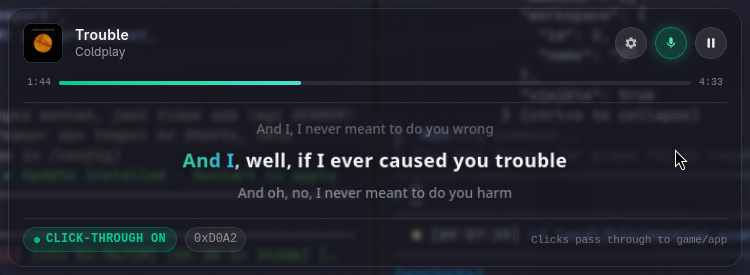
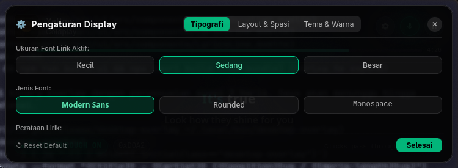

# 🎵 Spotify Lyrics HUD

<p align="center">
  
</p>

<p align="center">
  <a href="https://v2.tauri.app/"></a>
  <a href="https://svelte.dev/"></a>
  <a href="https://www.rust-lang.org/"></a>
  <a href="https://tailwindcss.com/"></a>
  <a href="LICENSE"></a>
</p>

<p align="center">
  <strong>A sleek, lightweight, transparent desktop karaoke lyrics overlay for Spotify.</strong><br />
  Native support for Linux (Wayland / Hyprland / X11) and Windows.
</p>

---

## ✨ Highlights

- 🎤 **Synchronized Karaoke Mode**: Smooth progressive gradient wipe as vocals are sung, with an instant toggle (`Ctrl+Shift+K` or header button).
- 📐 **3-Line Dead-Center Layout**: The active lyric line is mathematically guaranteed locked dead-center vertically, with previous lines dimmed above and upcoming lines dimmed below. No scroll drift, ever.
- ⚙️ **In-Place Glass Settings Modal**: Full control over typography, line modes, line spacing, dimming opacity, and highlight themes directly inside the HUD.
- 🖱️ **Click-Through (Passthrough)**: Allows mouse clicks and inputs to pass directly through to games, coding editors, or full-screen apps without focus stealing.
- 🖥️ **Multi-Monitor & Hyprland Native**: Automatically integrates with Hyprland IPC sockets to detect monitor geometry, active displays, and fullscreen status.
- 🗂️ **Dynamic System Tray**: Complete control menu with live track info, playback controls, monitor selection, anchor positioning, and quick display presets.

---

## 📸 Screenshots

| 3-Line Karaoke HUD (Live) | In-Place Settings Modal |
|:---:|:---:|
|  |  |

---

## ⌨️ Global Shortcuts

| Shortcut | Action | Description |
|---|---|---|
| `Ctrl + Shift + X` | **Toggle Click-Through** | Switch between interactive HUD and mouse passthrough |
| `Ctrl + Shift + H` | **Toggle Visibility** | Show or hide the overlay window |
| `Ctrl + Shift + K` | **Toggle Karaoke Mode** | Switch between smooth karaoke wipe and solid theme glow |
| `Ctrl + Shift + Space`| **Play / Pause** | Control Spotify playback |
| `Ctrl + Shift + M` | **Cycle Monitor** | Switch HUD between connected displays |

---

## ⚙️ Display Customization Options

Inside the in-place Settings Modal (opened via `⚙️` in the HUD or via System Tray):

- **Tipografi (Typography)**:
  - Font Size: *Kecil* (Small), *Sedang* (Medium), *Besar* (Large)
  - Font Family: *Modern Sans*, *Rounded*, *Monospace*
  - Alignment: *Rata Kiri* (Left), *Tengah* (Center), *Rata Kanan* (Right)
- **Layout & Spasi (Layout & Spacing)**:
  - Line Mode: *1 Baris Fokus* (Single line), *3 Baris Terpusat* (Triple line centered), *Scroller Penuh* (Full continuous scroller)
  - Line Spacing: *Rapat* (Compact), *Normal* (Balanced), *Renggang* (Relaxed)
  - Inactive Lyric Dimming: *25%* (Subtle), *45%* (Balanced), *70%* (Clear)
- **Tema & Warna (Theme & Colors)**:
  - Highlight Theme: *Spotify Emerald*, *Sky Cyan*, *Neon Violet*, *Pure White*
  - HUD Background Style: *Glass Blur*, *Ultra Minimal*, *Solid Dark*

---

## 🚀 Getting Started

### Prerequisites

- **Node.js** (v18+)
- **Rust** & **Cargo** (latest stable)
- **Spotify** desktop client running
- Linux: `playerctl` and `dbus` (for MPRIS playback integration)

### Installation & Build

```bash
# Clone repository
git clone https://github.com/<your-username>/spotify-lyrics-hud.git
cd spotify-lyrics-hud

# Install dependencies
npm install

# Run unit & integration test suite (105 tests)
npm test

# Build frontend and Rust native binary
npm run build && npm run build:ui && npx tauri build --no-bundle

# Install binary to ~/.local/bin
cp src-tauri/target/release/desktop-overlay ~/.local/bin/spotify-lyrics-hud
```

### Running

```bash
~/.local/bin/spotify-lyrics-hud &
```

---

## 🛠️ Architecture & Tech Stack

- **Framework**: [Tauri v2](https://v2.tauri.app/) (Rust backend + Web frontend)
- **Frontend**: [Svelte](https://svelte.dev/) with TypeScript & [Tailwind CSS v4](https://tailwindcss.com/)
- **Lyrics Provider**: Synchronized LRC parser powered by [LRCLIB](https://lrclib.net/)
- **IPC & Media**: Linux D-Bus MPRIS client with zero external dependencies
- **Window Management**: Wayland layer-shell protocol & Hyprland UNIX domain socket IPC

---

## 🤝 Contributing

Contributions, issues, and feature requests are welcome! Feel free to check the [issues page](https://github.com/<your-username>/spotify-lyrics-hud/issues) or see [CONTRIBUTING.md](CONTRIBUTING.md).

---

## 📄 License

Distributed under the MIT License. See [`LICENSE`](LICENSE) for more information.
